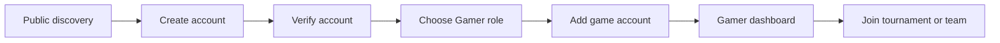
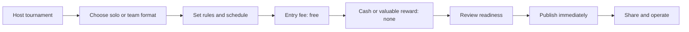
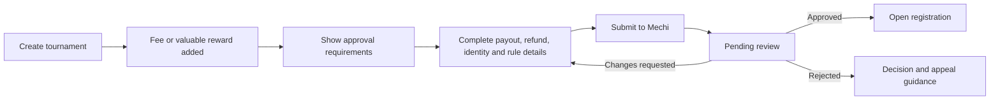
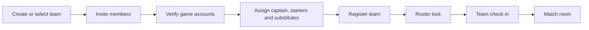
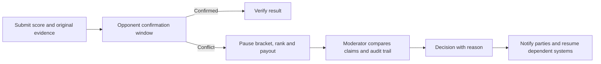
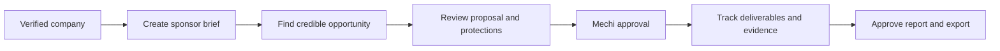
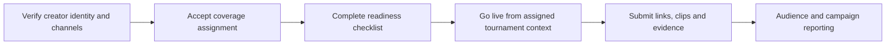
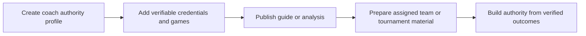
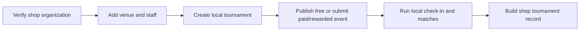

# Mechi V5 Product and UX Blueprint

Status: canonical design-first product contract
Owner: Mechi
Figma source: `PlayMechi — Homepage / Design System` (`pGJLHjMuAojRug16wBBR82`)
Last audited: 18 July 2026
Audience: product, design, engineering, operations, support, finance, growth, and tournament moderators

## 1. Executive decision

Mechi V5 is a clean product generation. It does not inherit the V4 interface, navigation, page composition, or dark visual language.

The V5 contract is:

- Figma is the visual and interaction source of truth.
- Backend rules and verified live data are the behavioral source of truth.
- Existing backend services may be reused behind V5 screens when their behavior matches this document.
- A legacy page must not appear as a fallback inside a V5 journey.
- A V5 route is not complete until its loading, empty, error, permission, success, and recovery states are designed.
- Desktop, tablet, and mobile are first-class layouts, not scaled copies.

Mechi's main offering to gamers is a trusted competition identity and operating layer: discover suitable competition, enter solo or with a team, coordinate matches, submit verifiable results, resolve disputes fairly, and turn verified performance into rank and reputation.

The larger platform enables:

| Audience | Core value |
| --- | --- |
| Gamers | Find matches and tournaments, record results, and build rank and reputation. |
| Organizers | Create and operate credible tournaments without spreadsheets and chat chaos. |
| Streamers | Turn tournament coverage into content, evidence, and audience growth. |
| Coaches | Demonstrate expertise and build authority through verified work and educational content. |
| Companies | Sponsor credible tournaments and measure delivery to gaming communities. |
| Gaming shops | Host local tournaments under a verified shop organization. |

## 2. Locked product rules

These rules must be visible in the interface and enforced in the backend.

1. Any eligible Mechi user may host a free tournament.
2. A tournament is free only when it has no entry fee, no cash prize, and no reward with monetary or material value.
3. A genuinely free, no-reward tournament may publish immediately after required safety and completeness checks pass.
4. A tournament with an entry fee, cash prize, sponsored prize, voucher, merchandise, or other valuable reward requires Mechi approval before public registration opens.
5. Paystack is the payment rail for Mechi-controlled tournament payments.
6. Solo and team tournaments are supported.
7. Players, captains, organizers, and authorized moderators may upload evidence according to their permission and case context.
8. A disputed result pauses bracket advancement, rank changes, reputation changes, and payout eligibility until an authorized decision is recorded.
9. Coach booking is outside the current V5 scope.
10. Gaming-station, PlayStation-shop, and hourly gaming booking are outside the current V5 scope.
11. Direct sponsor-to-organizer money movement is outside the normal product flow; sponsorship commitments and evidence remain Mechi-reviewed and auditable.
12. Destructive, money-moving, identity, eligibility, moderation, and payout actions require explicit confirmation and an audit trail.

Approval classification must be deterministic:

```text
requires_mechi_approval =
  entry_fee > 0
  OR cash_prize > 0
  OR valuable_reward_exists
  OR sponsor_funded_reward_exists
  OR manual_risk_flag_exists
```

## 3. Product boundaries for V5

### Included

- Tournament discovery, detail, hosting, registration, payment, check-in, match operations, results, disputes, brackets, standings, communications, reporting, and payouts.
- Solo and team identity, rosters, invitations, permissions, readiness, and public records.
- Player rank, reputation, match history, wallet, receipts, prizes, notifications, and messaging.
- Organizer and organization workspaces.
- Streamer coverage workspaces and public authority surfaces.
- Coach expertise, guides, analysis, preparation, and public authority surfaces without booking.
- Company sponsorship discovery, briefs, proposals, campaign tracking, evidence, and reports.
- Gaming-shop venue identity, staff, and local tournament operations without station booking.
- Mechi admin approval, verification, moderation, payout review, audit, and risk surfaces.
- Public games, rankings, profiles, organizations, streams, help, legal, and regional discovery.

### Excluded for this design cycle

- Coach session marketplace, calendar, availability, session checkout, or paid coaching booking.
- Gaming-shop hourly station booking, inventory reservation, availability calendar, or KES-per-hour checkout.
- Gambling, wagering, betting, stake pools, or user-to-user cash challenges.
- Direct unreviewed prize or sponsor transfers.
- A general-purpose social feed that competes with tournament and reputation workflows.
- Native mobile-app-only patterns that have no web equivalent; the web remains responsive and installable.

## 4. Experience principles

### P1 — The next action is obvious

Every operational page answers three questions above the fold:

1. What is happening?
2. What needs my attention?
3. What can I safely do next?

There is one dominant primary action per view. Secondary actions are visually quieter.

### P2 — Status includes meaning and recovery

Never show only `Pending`, `Blocked`, or `Failed`. Show:

- the status;
- why it has that status;
- who owns the next action;
- what the user can do;
- any deadline or consequence.

Example: `Pending approval — Mechi is checking the KES 8,000 prize terms. You can edit the draft, but registration stays closed.`

### P3 — Progressive disclosure

Complexity appears only when relevant:

- selecting `Team` reveals roster rules;
- adding any valuable reward reveals approval requirements;
- choosing paid entry reveals Paystack and refund settings;
- opening a dispute reveals evidence comparison and decision controls only to authorized roles;
- advanced seeding, API, and sponsor controls remain collapsed until requested.

### P4 — Preserve context

After login, verification, payment handoff, interrupted registration, permission upgrade, or dispute action, return the user to the exact tournament, match, campaign, or case they were working on.

### P5 — Trust is designed, not claimed

Verified identities, official results, payment references, evidence timestamps, moderator decisions, roster locks, and sponsor deliverables use consistent visual patterns and plain-language explanations.

### P6 — Mobile is operational

Mobile must support the complete journey, including host, check-in, evidence upload, dispute response, admin review, and payout review. Long pages use sticky local navigation, accordions, and section-level loading rather than endless unstructured scrolling.

### P7 — Low-bandwidth resilience

- Text and status load before decorative media.
- Uploaded evidence shows compression/progress/retry states.
- Draft forms save locally and remotely when safe.
- A lost connection never causes duplicate registration or payment.
- All critical information remains understandable without animation or imagery.

### P8 — Inclusive, safe interaction

- Minimum target: 44 by 44 CSS pixels; 48 pixels preferred for primary mobile actions.
- WCAG 2.2 AA contrast for text and interactive states.
- Visible keyboard focus; logical tab and reading order.
- Never encode state by color alone.
- Reduced-motion behavior for transitions, timers, live updates, and bracket movement.
- Errors are associated with fields and summarized at the top of long forms.
- Safety controls are available without requiring contact with the reported user.

## 5. Role and permission model

A person has one account and may activate multiple roles. Roles change the workspace, not the identity.

| Role | May view | May create/change | High-risk restrictions |
| --- | --- | --- | --- |
| Gamer | Public competition, own entries, matches, teams, rank, wallet | Profile, game accounts, teams, registration, check-in, reports, evidence | Cannot verify own disputed result or release money. |
| Team captain | Team workspace and tournament readiness | Invite/remove members, assign starter/substitute, submit team registration | Roster changes lock according to tournament rules. |
| Organizer | Own organization and tournament operations | Free/no-reward tournaments; drafts for paid/rewarded events; participant and match operations | Paid/rewarded publishing requires Mechi approval; payout release remains gated. |
| Organizer staff | Assigned organization/tournament areas | Only actions granted by role: operations, communications, finance-read, analyst | Least privilege; all privileged actions audited. |
| Streamer | Coverage opportunities, assignments, content evidence, audience | Stream profile, coverage schedule, stream links, clips, evidence | Cannot alter official match results. |
| Coach | Public expertise, guides, analysis, team preparation | Profile, credentials, guides, analysis artifacts | No booking or paid-session marketplace in this phase. |
| Company sponsor | Marketplace, briefs, proposals, active campaigns, reports | Company profile, sponsor brief, proposal decisions, evidence approvals | Commitments and protected funds follow Mechi review. |
| Gaming shop | Shop organization, venue, local tournaments, staff | Shop profile, venue details, free events, paid/rewarded drafts | No station booking; paid/rewarded events require approval. |
| Moderator | Assigned cases, evidence, communications, audit context | Request evidence, resolve scoped disputes/reports, apply scoped actions | Cannot review a case with a conflict of interest. |
| Mechi admin | Platform operations and risk surfaces | Approval, verification, moderation, payout authorization, overrides | Step-up authentication and immutable audit for critical actions. |

Workspace switching rules:

- The active workspace is always named in the shell.
- A user can see why an unavailable workspace is locked and how to qualify.
- Switching workspace preserves the last visited location for each role.
- Notification and inbox views can aggregate roles, but every item identifies its workspace.
- An action begun in one role cannot silently complete under another role.

## 6. Information architecture

### 6.1 Public shell

Primary navigation:

- Tournaments
- Games
- Rankings
- Watch
- For organizers
- For partners
- Search
- Sign in / Join Mechi

Public routes:

```text
/
/tournaments
/tournaments/[slug]
/tournaments/[slug]/bracket
/tournaments/[slug]/participants
/games
/games/[slug]
/rankings
/players/[username]
/teams/[slug]
/organizations/[slug]
/watch
/watch/[streamId]
/support
/support/[articleSlug]
/legal/terms
/legal/privacy
/legal/community-rules
/regions/[country]
```

### 6.2 Identity shell

Focused, low-distraction routes:

```text
/login
/signup
/verify
/forgot-password
/reset-password
/mfa
/onboarding
```

The identity shell has no dense product navigation. It offers a safe route back, clear progress, and a contextual reason for authentication.

### 6.3 Gamer shell

Desktop side navigation:

- Overview
- Tournaments
- Matches
- Team
- Rankings
- Wallet
- Notifications
- Messages
- Profile

Mobile bottom navigation:

- Home
- Tournaments
- Matches
- Team
- More

### 6.4 Organizer shell

- Overview
- Tournaments
- Participants
- Match operations
- Communications
- Finance
- Analytics
- Organization
- Staff and permissions

### 6.5 Creator and streamer shell

- Overview
- Content
- Live
- Coverage
- Tournaments
- Audience
- Opportunities
- Earnings / reports
- Profile

### 6.6 Coach shell

- Overview
- Expertise
- Guides
- Analysis
- Team preparation
- Results
- Profile

No booking, calendar, rate card, or session checkout appears.

### 6.7 Sponsor shell

- Overview
- Marketplace
- Briefs
- Proposals
- Campaigns
- Evidence
- Reports
- Company and team

### 6.8 Gaming-shop shell

- Overview
- Local tournaments
- Venue
- Community
- Staff
- Analytics
- Shop profile

No station availability or hourly booking appears.

### 6.9 Mechi admin shell

- Operations
- Tournament approvals
- Sponsorship approvals
- Verification
- Moderation and appeals
- Payout releases
- Risk and audit
- Platform health

## 7. Canonical end-to-end flows

### 7.1 New gamer



The onboarding may be skipped after the minimum safe identity is created, but every skipped item shows its later consequence.

### 7.2 Free, no-reward tournament



The review screen explicitly states: `This event qualifies for immediate publishing because it is free to enter and offers no cash or valuable reward.`

### 7.3 Paid or rewarded tournament



### 7.4 Team tournament



### 7.5 Result and dispute



### 7.6 Sponsorship



### 7.7 Streamer



### 7.8 Coach



### 7.9 Gaming shop



## 8. Current Figma audit

The file currently contains 56 pages.

### 8.1 Foundations and reusable library already present

| Pages | Contents | Decision |
| --- | --- | --- |
| 00–01 | Cover and foundations | Keep and extend. |
| 02–07 | Button, badge, tournament card, audience card, header, footer | Reuse. |
| 08–09 | Earlier homepage drafts | Archive as historical exploration; never implement. |
| 10 | Homepage — HCI Polish | Canonical homepage. |
| 11 | App UI index | Replace/extend with a V5 canonical index after all flows are complete. |
| 12–15 | Navigation, forms, feedback, tournament operations | Reuse and extend. |

Local design-system health:

- 3 variable collections: Primitives, Color, Dimensions.
- 86 local variables with scoped semantic colors, spacing, and radii.
- Light and dark semantic color modes exist; V5 product screens remain light-first unless a future approved use case requires dark.
- 13 text styles using Montserrat for display/headings and Open Sans for body/labels.
- 5 effect styles for soft/raised shadow and focus treatments.
- No Code Connect files currently exist in the repo.
- No external library is subscribed to the Figma file.
- External library search returned no compatible assets; local V5 components are the correct reuse source.

### 8.2 Existing screen families

Legend:

- `Approved`: visually part of the canonical V5 system.
- `Refine`: useful design exists, but its states or HCI coverage must be completed.
- `Reference`: may inform the solution but must not override the canonical shell.

| Figma page | Screen family | Status | Required follow-up |
| --- | --- | --- | --- |
| 10 | Homepage — HCI Polish | Approved | Preserve as canonical public home. |
| 16 | Tournament directory | Approved | Add saved-filter and no-results state to state matrix. |
| 17 | Tournament detail | Approved | Confirm public participant and stream affordances. |
| 18 | Host tournament | Refine | Add explicit free/no-reward versus approval branch and draft recovery. |
| 19 | Registration and payment | Refine | Complete solo/team, consent, Paystack handoff, and duplicate-payment prevention states. |
| 20 | Match room | Approved | Add low-bandwidth upload and reconnect variants. |
| 21 | Bracket and standings | Approved | Add live-update, paused, and accessible bracket alternatives. |
| 22 | Tournament control center | Approved | Make readiness and blockers reusable. |
| 23 | Dispute resolution | Approved | Add conflict-of-interest and escalation states. |
| 24 | Tournament finance and payouts | Refine | Separate organizer visibility from Mechi release authority. |
| 25 | Participants and check-in | Approved | Add QR/manual check-in and late/no-show states. |
| 26 | Match operations | Approved | Add bulk actions with undo/confirmation. |
| 27 | Communications and reminders | Approved | Add delivery failure and audience preview. |
| 28 | Analytics and sponsor reporting | Approved | Add privacy thresholds and export state. |
| 29 | Organization workspace | Refine | Add staff roles, access requests, and verification status. |
| 30 | Sponsorship marketplace | Approved | Add saved opportunities and suitability explanation. |
| 31 | Sponsorship proposal | Refine | Clarify sponsor versus organizer actions and Mechi approval. |
| 32 | Active sponsorship campaign | Approved | Add evidence rejection/revision state. |
| 33 | Sponsor report and evidence export | Approved | Add export progress and signed report state. |
| 34 | Streamer workspace and coverage | Refine | Add onboarding, assignment detail, live readiness, and evidence states. |
| 35 | Coach workspace and expertise | Refine | Remove any booking implication; add guides, analysis, and authority flows. |
| 36 | Gaming shop and local tournament hub | Refine | Remove booking implications; add venue, staff, and local-event setup. |
| 37 | Gamer dashboard and reputation | Approved | Keep as canonical gamer operational dashboard. |
| 38 | Team workspace and roster | Approved | Add create/join/invite/transfer/leave overlays and roster-lock recovery. |
| 39 | Public rankings and leaderboards | Approved | Add game, region, season, player/team, and unranked states. |
| 40 | Public gamer profile and match history | Approved | Add privacy, suspended, and incomplete-profile states. |
| 41 | Notifications and inbox summary | Approved | Add preferences and cross-workspace filtering. |
| 42 | Full inbox and conversation | Approved | Add report/block, attachment, sy…726 tokens truncated…ectory and Game Hub | `/games`, `/games/[slug]` | Featured games, supported formats, live/upcoming tournaments, rankings, organizers, streams, game-specific empty state. |
| 61 Screen — Watch Directory and Stream Viewer | `/watch`, `/watch/[streamId]` | Live/upcoming/VOD discovery, tournament context, accessible player, chat boundary, schedule, related matches, offline/ended states. |
| 62 Screen — Global Search and Command Results | global search | Query, grouped results, filters, keyboard command state, recent searches, no results, permission-hidden explanation. |
| 63 Screen — Regional and Game Landing Templates | `/regions/[country]` and campaign landing | Kenya-first local discovery, region filters, trusted organizers, games, tournaments, rankings, reusable SEO-safe template. |

### Batch C — role and workspace onboarding

| Planned page | Required variants |
| --- | --- |
| 64 Screen — Role and Workspace Switcher States | First role, add role, switch role, unavailable role, pending verification, access request, expired invitation, safe role exit. |
| 65 Screen — Organization, Company and Shop Onboarding | Organizer organization, sponsor company, gaming shop; identity, ownership, team, public profile, verification, completion and pending-review states. |
| 66 Screen — Streamer Onboarding and Coverage Setup | Channels, audience evidence, games, regions, coverage preferences, verification, live-readiness test, completion. |
| 67 Screen — Coach Onboarding, Verification and Public Authority | Games, expertise, credentials, consent, public profile, guide categories, verification; explicitly no booking setup. |

### Batch D — role home and working-detail gaps

| Planned page | Purpose |
| --- | --- |
| 68 Screen — Organizer Portfolio and Home | Cross-tournament overview, drafts, approvals, live issues, upcoming tasks, staff access, organization health. |
| 69 Screen — Company Sponsor Dashboard and Brief Builder | Campaign overview, budget bands, audience goals, deliverables, brief draft/review/submit, company-team access. |
| 70 Screen — Stream Assignment Detail and Live Console | Assignment terms, credentials, schedule, readiness, stream URL/key handling, live health, evidence submission, completion. |
| 71 Screen — Coach Guides, Analysis and Team Preparation | Guide library/editor, analysis workspace, evidence annotation, preparation checklist, publish/draft/archived states. |
| 72 Screen — Gaming Shop Venue, Staff and Local Event Setup | Venue identity, capacity/stations as venue facts only, staff roles, equipment notes, local event setup, check-in operations; no hourly booking. |

### Batch E — Mechi operations and trust back office

| Planned page | Required variants |
| --- | --- |
| 73 Screen — Mechi Admin Operations Overview | Live platform status, approvals, disputes, payments, payout blockers, risk alerts, country/game filters, handoff to specialist queues. |
| 74 Screen — Tournament Approval Queue and Review | Queue filters, free/reward classifier, organizer history, rules, prize/refund/payment checks, approve, changes requested, reject, escalation. |
| 75 Screen — Sponsorship Approval Queue and Review | Company and organizer verification, proposal terms, protected money state, deliverables, conflicts, decision and audit. |
| 76 Screen — Identity and Organization Verification Queue | Gamer payout identity, organizer, sponsor company, shop, streamer, coach; request info, approve, reject, expire, re-submit. |
| 77 Screen — Moderation Reports, Appeals and Case Review | Reports queue, subject context, evidence, conversation, related history, conflict check, action ladder, appeal decision. |
| 78 Screen — Payout Release Queue and Review | Winner eligibility, final-result lock, disputes, KYC, Paystack reference, two-person approval, failed/retry/reversed states. |
| 79 Screen — Risk, Audit Logs and Platform Health | Immutable action log, actor/workspace filters, anomaly flags, webhook/payment incidents, export, redacted sensitive values. |

### Batch F — system, legal, and canonical map

| Planned page | Contents |
| --- | --- |
| 80 Screen — Legal, Consent and Communication Preferences | Terms, privacy, community rules, tournament-specific consent, marketing preferences, change notice, data rights. |
| 81 V5 Canonical Screen Index and User Flow Map | Every approved component and screen page, route, role, responsive frame, state coverage, prototype starting points, and implementation status. |

This plan adds 26 pages, taking the file from 56 to 82 pages. Four are component documentation pages, 21 are responsive screen families, and one is the canonical index. Existing pages are refined in place rather than duplicated.

## 10. Screen-level state contract

Every data-driven screen must deliberately cover the applicable rows below.

| State | Required UI behavior |
| --- | --- |
| Initial loading | Preserve shell and page geometry; use labeled skeletons; do not flash misleading zero values. |
| Section refresh | Keep usable content visible; show localized progress and last-updated time. |
| Empty first use | Explain the value, show one primary next action, and avoid blame. |
| Empty filtered | Preserve filters, explain no match, offer clear/reset without erasing the query unexpectedly. |
| Validation error | Inline field message, top summary for long forms, focus first invalid field. |
| Network error | State what was not saved, show retry, preserve typed/uploaded work. |
| Offline | Show cached/last-known data, queue only safe actions, block money/decision actions that require live confirmation. |
| Unauthorized 401 | Re-authenticate and return to the exact context. |
| Forbidden 403 | Explain required role/permission and offer request/switch path. |
| Not found 404 | Distinguish removed, private, invalid link, and truly missing when known. |
| Conflict 409 | Explain the newer state and let the user review before retrying. |
| Rate limited 429 | Show wait guidance; never encourage repeated submission. |
| Service incident | Name affected capability, unaffected alternatives, and status-update path. |
| Success | Confirm what changed, show durable reference when relevant, and provide the next logical action. |
| Partial success | Separate completed and failed items, never summarize as full success. |
| Pending external action | Identify Paystack, opponent, organizer, moderator, sponsor, or Mechi as the current owner. |
| Expired | Explain effect and whether the flow can be safely restarted. |
| Suspended/restricted | Show scope, reason category, duration, allowed actions, evidence, and appeal path. |

## 11. Forms and decision design

### Tournament creation

Use a saveable, resumable wizard with a visible summary:

1. Basics — title, game, region, organizer, banner.
2. Format — solo/team, bracket/lobby format, participant count, roster rules.
3. Schedule — timezone-aware dates, check-in, rounds, dispute window.
4. Entry and rewards — free/paid, prize/reward classification, refund rules.
5. Rules and evidence — eligibility, proof, no-show, conduct.
6. Registration form — required fields and consent preview.
7. Review — readiness, approval classification, public preview.
8. Publish or submit — immediate free publish, or Mechi approval submission.

The user sees the approval consequence at step 4, not only after completing the form.

### Registration

- Show eligibility before collecting details.
- Show whether the user is registering as self, captain, or selected team.
- Reserve a slot only when the backend can guarantee it.
- For paid entry, state reservation expiry before Paystack handoff.
- Never allow a retry to create a second slot or second charge.
- Confirmation includes entry identity, tournament, schedule, check-in, receipt/reference, and next action.

### Evidence upload

- Accepted file types and size are shown before selection.
- Preserve original file metadata when allowed.
- Each file has upload progress, retry, remove-before-submit, and immutable-after-submit behavior.
- A thumbnail is never the only proof that upload succeeded.
- Users can add a plain-language note and timestamp context.

### Admin decision panels

- Facts and evidence appear before action controls.
- The decision reason is required and previewed as the user will receive it.
- High-risk actions state downstream effects before confirmation.
- Approval and payout release require step-up authentication when policy demands it.
- Conflicts of interest block assignment and decision.

## 12. Responsive behavior

### Desktop — 1440

- 240-pixel role navigation where an authenticated workspace applies.
- Primary content and supporting rail use a stable 8/4 or 9/3 grid.
- Dense tables remain readable and offer column controls rather than horizontal clipping.
- Persistent action bars are reserved for long forms, live operations, and admin decisions.

### Tablet — 1024

- Navigation collapses to top shell or temporary drawer.
- Supporting rail moves below primary content unless it contains a blocking action, in which case it becomes a sticky summary.
- Tables adapt to priority columns plus expandable row detail.
- No desktop-only hover dependency.

### Mobile — 390

- Bottom navigation contains no more than five destinations; `More` exposes role-specific remainder.
- Sticky local tabs or an anchored section menu tame long operational screens.
- Summary cards appear before detail and action queues.
- Data tables become labeled record cards or priority-column lists.
- Primary actions may use a safe-area-aware sticky footer, never cover content, and must not coexist with another competing sticky CTA.
- Brackets provide an accessible match list alongside visual bracket navigation.

## 13. Content and terminology

Use:

- `Tournament`, not alternating with event/competition when referring to the same object.
- `Entry fee`, `prize`, and `reward` as separate concepts.
- `Verified result`, `reported result`, and `disputed result` consistently.
- `Organizer`, `moderator`, `team captain`, `streamer`, `coach`, `company`, and `gaming shop` as role labels.
- `Mechi approval` when a platform operator decision is required.
- `Paystack reference` only where the user benefits from the technical label; otherwise use `payment reference`.

Avoid:

- vague labels such as `Process`, `Submit`, `Continue`, or `Manage` when a specific verb is possible;
- `Wallet balance` if money is pending, protected, non-withdrawable, or merely historical;
- `Approved` without naming what was approved;
- `Free` when a required purchase, valuable contribution, or prize condition exists;
- implying booking on coach or gaming-shop screens.

## 14. Accessibility and HCI quality gate

Each responsive frame must pass:

- [ ] Page purpose and primary action are identifiable in five seconds.
- [ ] Heading hierarchy is logical and contains one page-level heading.
- [ ] Keyboard order matches the visual order.
- [ ] Focus is visible on every control and restored after overlays close.
- [ ] All interactive targets meet minimum size and spacing.
- [ ] Text and meaningful graphics meet AA contrast.
- [ ] Status uses icon/text/shape in addition to color.
- [ ] Form labels remain visible after entry; placeholders are examples only.
- [ ] Errors say what happened and how to fix it.
- [ ] Timers do not rely on color or motion and include absolute time in EAT where relevant.
- [ ] Live regions are defined for material score/status changes without overwhelming assistive technology.
- [ ] Tables have an equivalent mobile and screen-reader structure.
- [ ] Brackets have an ordered match-list alternative.
- [ ] Evidence viewers support descriptive filename, type, submitter, and timestamp.
- [ ] Reduced motion and 200% text zoom do not remove information or actions.
- [ ] Empty and permission states offer a productive next step.
- [ ] Destructive and money-moving actions require confirmation proportional to risk.

## 15. Backend readiness tags for design handoff

Every Figma screen annotation should use one of:

- `READY`: an existing backend contract can support the primary journey.
- `EXTEND`: an existing domain/API can support it after scoped fields or states are added.
- `NEW`: a new durable model/API/permission is required.
- `OPS`: the screen depends on a Mechi operating policy or manual control in addition to software.

Current high-level mapping:

| Domain | Readiness |
| --- | --- |
| Public tournament list/detail | READY / EXTEND for richer filters and participant views |
| Free tournament creation | EXTEND for canonical V5 wizard and policy classifier |
| Paid/rewarded approval | EXTEND / OPS |
| Solo registration and Paystack verification | READY / EXTEND for full recovery states |
| Teams and rosters | NEW / EXTEND from current player model |
| Check-in | READY / EXTEND for team and QR/manual modes |
| Match result reporting and disputes | READY / EXTEND for unified evidence audit |
| Brackets and standings | READY / EXTEND for formats and accessible projections |
| Organization membership and RBAC | NEW |
| Sponsorship lifecycle | NEW |
| Streamer assignment and evidence | NEW / EXTEND from stream infrastructure |
| Coach guides, analysis and verification | NEW |
| Gaming-shop venue and staff | NEW |
| Mechi approval/moderation/payout queues | EXTEND / NEW / OPS |
| Notifications and inbox | READY / EXTEND for cross-workspace context |
| Wallet, receipts and payout status | EXTEND with strict ledger semantics |
| Partner API keys and webhooks | NEW |

## 16. Figma construction rules

- Reuse existing V5 variables, text styles, effect styles, and components.
- Add component variants only for stable differences; use component properties and slots to avoid variant explosion.
- Use auto layout for all structural relationships.
- Every new screen page starts with a title/status note and three responsive frames.
- Main components live on component pages; screens use instances.
- Use real, plausible East African names, KES examples, EAT time, games, and tournament language.
- Sensitive values such as stream keys, API secrets, full payment details, and identity documents are redacted in examples.
- Page 10 remains the homepage source of truth.
- Pages 08 and 09 are marked archived.
- Pages 54 and 55 are references to reconcile, not new canonical shells.
- Page 81 becomes the only canonical index after final review.

## 17. Design execution plan and exit criteria

### Phase 0 — Discovery and scope lock

- Audit code, Figma, routes, roles, backend readiness, and product constraints.
- Produce this blueprint and the gap analysis.

Exit: every current and missing screen family is classified; no unresolved V4/V5 source conflict remains.

### Phase 1 — Component extensions

- Build pages 56–59.
- Validate variable bindings, touch targets, typography, contrast, component properties, and variant matrices.

Exit: every new screen can be composed from existing or newly approved reusable components.

### Phase 2 — Public and onboarding

- Build pages 60–67.
- Prototype public discovery, authentication return, role activation, and organization verification entry points.

Exit: every audience can understand Mechi, create one identity, activate the correct role, and reach a useful first workspace.

### Phase 3 — Role workspaces

- Build pages 68–72.
- Refine existing pages 18, 29, 34, 35, 36, 43, 44, 49, 51, 52.

Exit: organizer, company, streamer, coach, and gaming shop have complete non-admin primary journeys with no booking leakage.

### Phase 4 — Mechi admin and trust

- Build pages 73–79.
- Prototype approval, information request, rejection, appeal, payout release, and incident drill-down.

Exit: every gated user action has a corresponding operator surface and every operator decision has a user-facing outcome.

### Phase 5 — Legal, states, flow map, and QA

- Build pages 80–81.
- Extend page 53 with all system states.
- Audit all responsive frames and prototypes.

Exit: no dead ends, unlabeled status, inaccessible control, unexplained permission, or legacy fallback remains.

## 18. Final design acceptance criteria

The V5 design phase is complete only when:

1. Every page in sections 8 and 9 has an approved disposition.
2. Every canonical screen has desktop, tablet, and mobile designs or a documented reason a state is overlay-only.
3. All six audiences can reach their primary value from the public homepage and onboarding.
4. A gamer can complete discovery, registration, check-in, match, result, dispute, rank, and wallet journeys.
5. A captain can create/join a team, manage a roster, register, lock, and check in.
6. Any eligible user can publish a free, no-reward tournament without Mechi approval.
7. Paid or rewarded events cannot appear publicly open before Mechi approval.
8. Organizers can operate participants, matches, disputes, communications, finance, and reports.
9. Streamer, coach, company, and shop experiences deliver their defined value without booking functionality.
10. Mechi operators can review every approval, verification, moderation, appeal, and payout dependency surfaced to users.
11. Paystack interruption, retry, duplicate, success, failure, refund, and payout statuses are understandable.
12. All critical states meet the HCI, accessibility, responsive, and low-bandwidth requirements.
13. Page 81 maps every screen to its route, role, backend readiness, and implementation status.
14. Engineering can build V5 without referring to a V4 visual component or guessing a missing state.

## 19. Cutover rule for implementation

Design approval does not authorize partial V5/V4 mixing. Implementation begins in an isolated V5 route and component tree. Production cutover occurs only after the critical public, identity, gamer, organizer, tournament, payment, and admin-gate journeys are wired and verified. Until then, the old product may remain operational, but it must never be presented as a completed V5 screen.

## 20. Figma execution outcome — 18 July 2026

The design-first scope is now represented in the canonical PlayMechi Figma file.

- The file contains 82 pages: the cover plus pages 01–81.
- Pages 56–59 add four component-library domains.
- Sixteen new stateful component sets cover identity, workspaces, people, permissions, invitations, readiness, review queues, evidence comparison, decisions, audit, dialogs, feedback, step-up authentication, and risky confirmation.
- Pages 60–80 add the missing public, account, role, operations, trust, finance, legal, and recovery screen families.
- Page 81 is the canonical screen index and primary flow map.
- Every page from 60–81 contains a desktop canonical frame, a mobile key-task frame, and the required loading, empty, error, and permission-state contract.
- Tablet behavior follows the 1024 responsive contract in section 12 instead of duplicating a static tablet frame for every family. Layouts interpolate from the desktop grid to the mobile stack using the documented auto-layout constraints.
- All new frames use the V5 light interface, semantic tokens, Montserrat/Open Sans typography, explicit status wording, singular primary actions, and recovery-oriented feedback.
- The final scope audit confirmed that coaching booking and hourly shop gaming appear only as explicit exclusions, not active capabilities.
- The tournament policy remains consistent: only KES 0 entry with no cash or valuable reward can publish without Mechi approval; paid-entry or rewarded events require approval.
- Payment, payout, destructive, moderation, and ownership actions show consequences, reasons, holds, step-up authentication, dual approval where applicable, and an auditable outcome.

This completes the screen-design inventory. Engineering implementation, backend wiring, prototype linking, and production cutover are separate phases and must follow the V5-only cutover rule in section 19.
