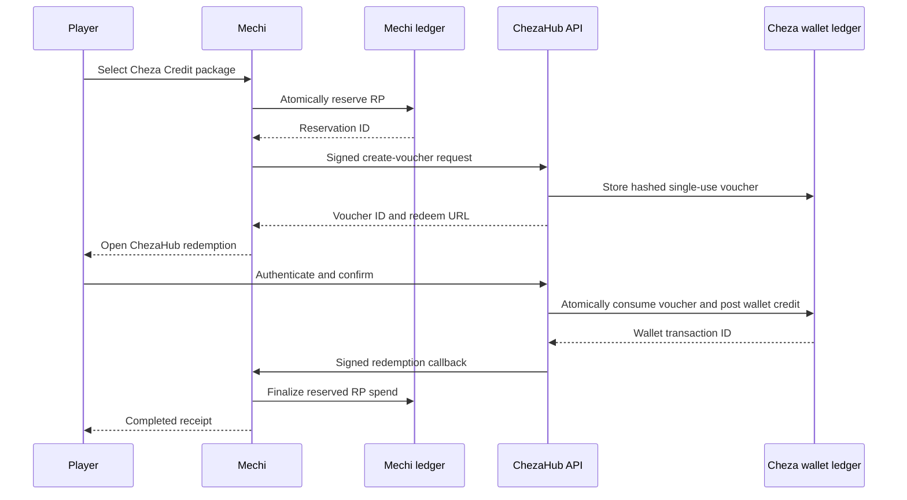

# PlayMechi v5 to ChezaHub Credit Integration Plan

Status: both production schemas live; shared secrets, feature flags, and controlled pilot pending
Owner: Mechi / ChezaHub operator
Last updated: 2026-07-22
Systems: `mechi.club` and `chezahub.co.ke`

Production note (2026-07-22): the ChezaHub bridge and hardening migrations and
the Mechi `playmechi_chezahub_credit_bridge` migration are live. Feature flags
must remain off until both deployments share the signing secret and the
controlled pilot checks pass.

## 1. Product decision

Build a controlled bridge that lets a verified PlayMechi player exchange available Mechi Reward Points (RP) for non-withdrawable Cheza Credit.

The public promise is:

> Play verified matches on PlayMechi, earn RP, and convert eligible RP into Cheza Credit for eligible purchases on ChezaHub.

Use these names consistently:

- `Mechi RP`: earned through verified activity on Mechi.
- `Cheza Points`: earned through eligible shopping on ChezaHub.
- `Cheza Credit`: KSh-denominated, closed-loop promotional value used only on eligible ChezaHub checkout items.
- `Tournament cash prize`: a separately administered payout. It is not RP or Cheza Credit.

Never call Cheza Credit cash, withdrawable funds, a deposit, or an M-Pesa balance. It cannot be withdrawn, transferred, sold, or converted back to either points currency.

## 2. Goals and non-goals

### Goals

- Reward verified play without creating an open cash wallet.
- Preserve one authoritative ledger in each system.
- Make redemption one-click for normal users and code-based as a recovery path.
- Prevent duplicate credit, replay attacks, multi-account farming, and unbudgeted liability.
- Give support and finance a complete cross-system audit trail.
- Launch behind limits and feature flags, with a reversible rollout.

### Non-goals for v1

- Cash or M-Pesa withdrawal.
- Person-to-person transfer.
- Selling or gifting vouchers.
- Combining the Mechi and ChezaHub databases.
- Replacing ChezaHub's existing points program.
- Allowing Cheza Credit on gift cards, gaming wallet top-ups, Fortnite, delivery, or fees.
- Automatic tournament cash-prize settlement.

## 3. Existing foundation to preserve

### Mechi

- `profiles.reward_points_available`, `reward_points_pending`, and `reward_points_lifetime` remain the Mechi balance authority.
- `apply_reward_event` remains the only balance mutation primitive.
- `reward_events.event_key` provides idempotency.
- `reward_redemptions`, `reward_review_queue`, and the admin rewards UI remain the operational foundation.
- Existing HMAC signing helpers in `src/lib/rewards.ts` remain the transport-authentication foundation.
- Existing game-redeemable order issuance remains separate from the new wallet-credit redemption type.

### ChezaHub

- `customer_wallets` remains the wallet balance authority.
- `wallet_transactions` remains immutable and append-only.
- `post_wallet_entry` remains the only primitive that changes Cheza Credit.
- Existing wallet holds, capture, release, and refund behavior remains unchanged.
- Existing Cheza Points-to-Cheza Credit conversion remains separate from Mechi RP redemption.
- Existing eligibility and 25% checkout coverage rules remain unchanged.

## 4. Recommended economics

Initial conversion rate:

- `10 Mechi RP = KSh 1 Cheza Credit`.
- Minimum redemption: `500 RP = KSh 50`.
- Packages: 500 RP, 1,000 RP, 2,500 RP, and 5,000 RP.
- Custom amounts are disabled during the pilot.

Initial limits:

- Maximum single redemption: 5,000 RP / KSh 500.
- Maximum successful redemption per player per rolling 30 days: KSh 500.
- Maximum three redemption attempts per player per day.
- Maximum ten invalid-code attempts per ChezaHub account and IP per hour.
- A configurable global monthly issuance budget stops new reservations when exhausted.
- Values above the automatic risk threshold go to review instead of being issued.

All rates and limits must be server-owned configuration with an effective date. Never accept a KSh value supplied by the client.

Finance must track outstanding unredeemed reservations and issued Cheza Credit separately. The monthly operating report should show issued RP value, expired/restored RP, redeemed Cheza Credit, wallet spend, refunds, and remaining promotional liability.

## 5. Target architecture



Both the create call and callback are retryable. Idempotency, not network success, determines the final state.

## 6. Identity model

The first redemption binds a Mechi profile to one ChezaHub user.

- ChezaHub authentication is required before wallet credit is posted.
- `profiles.chezahub_user_id` stores the established binding on Mechi.
- A ChezaHub partner binding table stores `partner = 'playmechi'`, `partner_user_id`, and `user_id`.
- Both sides enforce one active binding per Mechi profile and per ChezaHub user during the pilot.
- Email and phone may be used as user-facing hints, never as the durable cross-system key.
- Changing a binding requires an audited support workflow and must not be self-service in v1.
- The consent screen states exactly which identifiers and transaction references will be shared.

## 7. Redemption state machine

Mechi states:

```text
requested -> risk_review -> reserved -> issued -> redeemed -> completed
     |            |           |          |
     +----------> rejected     +-------> expired -> restored
                               +-------> voided  -> restored
                                           redeemed -> reconciliation_required
```

ChezaHub voucher states:

```text
issued -> redeemed
   +----> expired
   +----> voided
```

Rules:

- RP is unavailable to the player as soon as the Mechi reservation succeeds.
- RP lifetime balance is not reduced by spending.
- Only an unused `issued` voucher can expire or be voided.
- Expiration restores RP exactly once.
- A redeemed ChezaHub voucher can never be automatically voided.
- If the callback is lost, reconciliation completes the Mechi record from ChezaHub truth.
- Support corrections create compensating ledger entries; they never edit ledger history.

## 8. Mechi database changes

Create a migration through `supabase migration new playmechi_chezahub_credit_bridge` when implementation begins.

### `partner_reward_exports`

Required columns:

- `id uuid primary key`
- `user_id uuid not null references profiles(id)`
- `partner text not null check (partner = 'chezahub')`
- `reward_kind text not null check (reward_kind = 'cheza_credit')`
- `rp_amount integer not null check (rp_amount > 0)`
- `credit_kes numeric(12,2) not null check (credit_kes > 0)`
- `conversion_rate_rp_per_kes integer not null`
- `status text not null`
- `idempotency_key uuid not null unique`
- `external_voucher_id text unique`
- `external_wallet_transaction_id text unique`
- `chezahub_user_id uuid null`
- `expires_at timestamptz null`
- `redeemed_at timestamptz null`
- `completed_at timestamptz null`
- `risk_status text not null default 'clear'`
- `risk_reasons text[] not null default '{}'`
- `metadata jsonb not null default '{}'`
- timestamps

Do not store the plain voucher code. Store only a fingerprint returned by ChezaHub if operational correlation is required.

### Balance reservation RPC

Add a private/server-only function that, in one transaction:

1. Locks the player's profile row.
2. Confirms available RP, limits, and idempotency.
3. Inserts the export record.
4. Calls the existing `apply_reward_event` semantics to deduct available RP with event type `partner_credit_reservation`.
5. Returns the export.

Add server-only finalize and restore functions. Restoration inserts a compensating `partner_credit_reservation_reversal` event with a deterministic event key.

Enable RLS on the export table. Authenticated users may select their own safe fields. Only server/admin paths may insert or mutate. Do not place privileged `security definer` functions in an exposed schema; use an unexposed/private schema or revoke all client execution explicitly.

## 9. ChezaHub database changes

See the companion plan in `D:\chezahubstore\docs\PLAYMECHI_CREDIT_BRIDGE_EXECUTION_PLAN.md`.

Create:

- `partner_account_bindings`
- `partner_credit_vouchers`
- an atomic server-only `redeem_partner_credit_voucher` function
- an atomic server-only `void_partner_credit_voucher` function

Wallet credits use:

- transaction type: `partner_reward_credit`
- reference type: `playmechi_reward_export`
- reference ID: Mechi export UUID
- description: `PlayMechi reward - KSh {amount}`
- idempotency key derived from the voucher ID

The wallet function must lock the voucher, verify its status and expiry, enforce the authenticated user binding, call `post_wallet_entry`, and mark the voucher redeemed in the same database transaction.

## 10. Cross-system API contract

All partner requests use HTTPS, JSON, a timestamp, a unique request ID, and HMAC-SHA256 over a stable canonical body. Reduce the accepted clock window from the current ten minutes to five minutes for wallet actions. Store processed request IDs to prevent signed-message replay.

### Create voucher

`POST https://chezahub.co.ke/api/mechi/rewards/credit-vouchers`

Request:

```json
{
  "request_id": "uuid",
  "mechi_export_id": "uuid",
  "mechi_user_id": "uuid",
  "chezahub_user_id": "uuid-or-null",
  "rp_amount": 1000,
  "credit_kes": 100,
  "rate_version": "2026-07-v1",
  "expires_at": "ISO-8601"
}
```

Response:

```json
{
  "voucher_id": "uuid",
  "status": "issued",
  "redeem_url": "https://chezahub.co.ke/redeem/playmechi?t=opaque-token",
  "display_code": "PM5-XXXX-XXXX",
  "expires_at": "ISO-8601"
}
```

The display code is returned once and never logged. The deep-link token and code both resolve to the same hashed voucher record.

### Check voucher

`GET /api/mechi/rewards/credit-vouchers/{mechi_export_id}` is HMAC-authenticated and returns the current partner state. It is used by Mechi polling and reconciliation, not by browsers.

### Void unused voucher

`POST /api/mechi/rewards/credit-vouchers/{mechi_export_id}/void`

This succeeds idempotently for issued/voided vouchers and returns conflict for redeemed vouchers.

### Redemption callback

`POST https://mechi.club/api/integrations/chezahub/credit-redeemed`

Payload includes request ID, export ID, voucher ID, ChezaHub user ID, wallet transaction ID, credit amount, and redeemed timestamp. Mechi validates the binding and expected amount before completing the export.

### Error model

- `400`: malformed or invalid amount/rate.
- `401`: missing or bad signature.
- `409`: binding conflict, already redeemed, or state conflict.
- `410`: expired/voided voucher.
- `422`: risk/limit/business-rule rejection.
- `429`: rate limited.
- `5xx`: retryable server failure.

Responses must never reveal whether an arbitrary code exists unless the caller is authenticated and within rate limits.

## 11. Mechi application changes

### Backend

- Extend reward types with `cheza_credit` and the new export states.
- Add package/rate configuration and budget checks to `src/lib/rewards.ts` or a dedicated `src/lib/partner-rewards.ts`.
- Add `POST /api/rewards/cheza-credit/reserve`.
- Add `GET /api/rewards/cheza-credit/[id]`.
- Add `POST /api/rewards/cheza-credit/[id]/cancel` for unused reservations.
- Add signed callback and reconciliation endpoints.
- Keep the existing game-item redemption route working; do not overload its ChezaHub order semantics with wallet credit.
- Add export entries to the existing admin reward-review queue.

### Player UI

- Add a Cheza Credit section to `/rewards/catalog`.
- Show package, RP cost, KSh credit, eligibility, monthly remaining limit, and eligible-item restrictions.
- Confirmation screen states that conversion is final after redemption and credit is non-withdrawable.
- After issue, show `Redeem on ChezaHub` as the primary action and the code/copy action as fallback.
- Show a timeline: reserved, voucher ready, redeemed, completed.
- Show clear expired/restored and review states.
- Add a compact rewards summary to the PlayMechi v5 dashboard.

### Admin UI

- Filters for partner, state, value, risk status, age, and reconciliation status.
- Actions: approve, reject, retry issue, sync status, void unused, restore after confirmed void, and escalate.
- Never provide a one-click force-complete without confirming ChezaHub state.

## 12. ChezaHub application changes

- Add `/redeem/playmechi` route.
- If signed out, preserve the opaque token through sign-in/sign-up.
- Show issuer, value, restrictions, expiry, and target account before confirmation.
- Add `Redeem PlayMechi code` entry points on `/rewards` and `/wallet`.
- Show partner credits in wallet history with a PlayMechi label and reference.
- Add partner voucher/binding filters to the loyalty admin page.
- Add support-safe lookup by display-code suffix, Mechi export ID, voucher ID, ChezaHub user, or wallet transaction.
- Update Rewards Terms and Privacy copy before public launch.

## 13. Risk and fraud controls

Evaluate risk before reservation and again before ChezaHub redemption.

Signals:

- Account age and verified email/phone.
- Reward source and whether the result is final.
- Tournament reward eligibility and dispute status.
- Repeated matches against the same opponent.
- Impossible win rate, duration, or result cadence.
- Device/IP overlap across accounts.
- Referral relationship and self-referral indicators.
- Recent profile identity changes.
- Redemption velocity, failed-code attempts, and binding conflicts.
- Prior reversals, bans, or open reward reviews.

Outcomes:

- `clear`: issue automatically.
- `hold`: wait for the source event to mature.
- `review`: admin decision required.
- `deny`: do not issue; explain the policy category without exposing fraud rules.

Do not promise reward eligibility merely because a player registered or submitted a result.

## 14. Security and privacy checklist

- Plain codes never stored; use a slow keyed hash or HMAC fingerprint.
- Opaque deep-link token has at least 128 bits of entropy.
- Secrets remain server-only and are independently rotatable.
- Exact request canonicalization is shared by both repos and tested with fixtures.
- Constant-time signature comparison.
- Five-minute timestamp window plus request-ID replay table.
- Rate limits by IP, ChezaHub account, Mechi user, and code fingerprint.
- No service-role key in either browser bundle.
- RLS enabled on all new public tables; clients get read-only access only to their own safe records.
- Admin authorization uses server-owned roles, never user-editable metadata.
- Audit all approvals, binding changes, voids, restorations, and manual wallet adjustments.
- Consent copy covers cross-brand identity and reward-transaction sharing.
- Define retention and deletion behavior for bindings, risk metadata, and audit records.
- Run a data-protection impact assessment before full public rollout.

## 15. Reliability and reconciliation

Create a scheduled reconciliation job on Mechi:

- Find `reserved` exports older than five minutes with no external voucher and retry creation.
- Find `issued` exports and compare their ChezaHub status.
- Complete exports that ChezaHub reports as redeemed.
- Restore only after ChezaHub confirms voided or expired.
- Put amount, identity, or state mismatches into `reconciliation_required` and the review queue.

Daily finance reconciliation compares:

- Mechi RP reserved/restored/spent.
- ChezaHub vouchers issued/redeemed/expired/voided.
- ChezaHub `partner_reward_credit` wallet entries.
- Expected versus actual Cheza Credit liability.

Alert on duplicate references, callbacks failing for more than five minutes, budget exhaustion, abnormal redemption velocity, and reconciliation differences above zero.

## 16. Testing strategy

### Database tests

- Concurrent reservation cannot overspend RP.
- Concurrent code redemption credits the wallet once.
- Duplicate API request returns the original result.
- Expiration and void restore RP once.
- Redeemed voucher cannot be voided/restored.
- Wallet transaction immutability remains enforced.
- RLS prevents cross-user reads and all browser writes.

### Contract tests

- Shared canonical JSON and HMAC fixtures pass in TypeScript and JavaScript.
- Clock skew, replay, malformed payload, incorrect amount, and signature rotation cases.
- Every error code maps to a stable client behavior.

### End-to-end tests

- Existing linked user completes redemption.
- New ChezaHub user signs up and completes redemption.
- Sign-in redirect preserves the token.
- Manual code entry works.
- Expired, already-used, wrong-account, review, and budget-exhausted paths.
- Lost callback is repaired by reconciliation.
- Wallet credit is available at eligible checkout and excluded from ineligible products.
- Refund returns captured Cheza Credit to the same wallet.

### Regression gates

- Existing Cheza Points conversion passes.
- Existing checkout wallet hold/capture/release passes.
- Existing Mechi game redeemables pass.
- Existing match/tournament reward awards pass.
- Both repos pass lint, unit tests, type checks, production builds, and targeted browser tests.

## 17. Feature flags and configuration

Recommended flags:

- Mechi: `CHEZA_CREDIT_REDEMPTION_ENABLED`.
- Mechi: `CHEZA_CREDIT_AUTO_APPROVAL_ENABLED`.
- ChezaHub: `PLAYMECHI_VOUCHER_REDEMPTION_ENABLED`.
- ChezaHub: `PLAYMECHI_NEW_BINDINGS_ENABLED`.

Recommended shared configuration:

- rate version and RP-per-KSh rate
- package list
- minimum/maximum values
- per-user period limit
- global monthly budget
- voucher lifetime
- automatic approval threshold
- allowed wallet transaction type/version

Flags default off in production until migrations, contracts, monitoring, and terms are ready.

## 18. Delivery phases

### Phase 0: product and finance sign-off

- Approve names, rate, packages, eligibility, limits, budget, eligible SKUs, expiry, terms, and support ownership.
- Create a threat model and data-sharing record.
- Acceptance: a signed decision record with no unresolved money-state ambiguity.

### Phase 1: shared contract and schemas

- Add migrations, state types, HMAC fixtures, request replay protection, and feature flags.
- Acceptance: database and contract tests pass; no UI exposed.

### Phase 2: ChezaHub redemption foundation

- Build voucher creation/status/void APIs, atomic wallet-credit redemption, callback, route, wallet history, and admin lookup.
- Acceptance: synthetic voucher credits a test wallet exactly once and is fully auditable.

### Phase 3: Mechi reservation foundation

- Build RP reservation/finalize/restore, issuance client, callback receiver, reconciliation, review integration, and admin controls.
- Acceptance: network failures and duplicate requests cannot lose RP or duplicate Cheza Credit.

### Phase 4: player experience

- Add Mechi package selection and receipt timeline; add ChezaHub deep-link/manual-code flow and terms.
- Acceptance: authenticated and new-user E2E journeys pass on desktop and mobile.

### Phase 5: internal pilot

- Allowlist staff accounts; use KSh 50 and KSh 100 packages; daily manual reconciliation.
- Acceptance: at least 25 successful redemptions, zero duplicate credits, zero unexplained differences.

### Phase 6: closed beta

- Invite verified players; enable risk holds and a hard monthly budget.
- Acceptance: at least 100 successful redemptions, support resolution SLA met, fraud and conversion metrics reviewed.

### Phase 7: public PlayMechi v5 launch

- Enable packages gradually, publish help/terms, train support, and monitor in real time for the first 72 hours.
- Acceptance: reconciliation difference remains zero and budget/margin remain within approved thresholds.

## 19. Rollback plan

- Turn off new reservations first.
- Keep status, redemption, callback, and reconciliation endpoints running for already-issued vouchers.
- Never disable the ChezaHub redeem endpoint while valid issued vouchers remain unless vouchers are first voided and RP restored.
- If wallet posting is unsafe, block confirmation before consumption; do not mark vouchers redeemed.
- If Mechi callbacks fail, continue ChezaHub redemption and repair Mechi through reconciliation.
- Publish player messaging only after the exact affected population and resolution are known.

## 20. Operational ownership

- `control`: cross-system decision, reward reviews, GitHub truth, and launch coordination.
- `billing`: Cheza Credit liability, budget, refund/reversal policy, and monthly finance sign-off.
- `infra`: secrets, endpoint health, rate limits, alerts, scheduled reconciliation, and incident response.
- `data`: funnel, liability, fraud, margin, and cohort reporting.
- `support`: player-safe troubleshooting and escalation using transaction references.
- Tournament admins: verify results and eligibility; they do not manually credit wallets.

High-risk actions?manual wallet credits, binding changes, reward reversals, and public incident messaging?require an auditable reason and the appropriate operator role.

## 21. Launch metrics

Primary:

- Eligible players earning RP.
- RP earn-to-redemption conversion.
- Voucher issue-to-redeem conversion.
- Time from reservation to wallet credit.
- Cheza Credit used in eligible orders.
- Incremental buyers and incremental eligible merchandise revenue.

Guardrails:

- Outstanding promotional liability.
- Credit as a percentage of eligible gross margin.
- Duplicate-credit count.
- Reconciliation difference.
- Review/denial rate.
- Binding-conflict and failed-code rates.
- Support contacts per 100 redemptions.
- Fraud loss and reversal rate.

## 22. Definition of done

The integration is complete only when:

- Every RP deduction maps to one export record.
- Every redeemed export maps to one immutable ChezaHub wallet transaction.
- Duplicate and concurrent requests cannot duplicate credit.
- Unused expired/voided vouchers restore RP exactly once.
- Reconciliation proves both systems agree.
- Players understand RP, Cheza Points, and Cheza Credit as different balances.
- Wallet restrictions are enforced in code and terms.
- Support can trace a transaction without reading secrets or editing ledgers.
- Finance can measure and cap liability.
- Security, privacy, database, contract, E2E, and rollback checks have passed.
